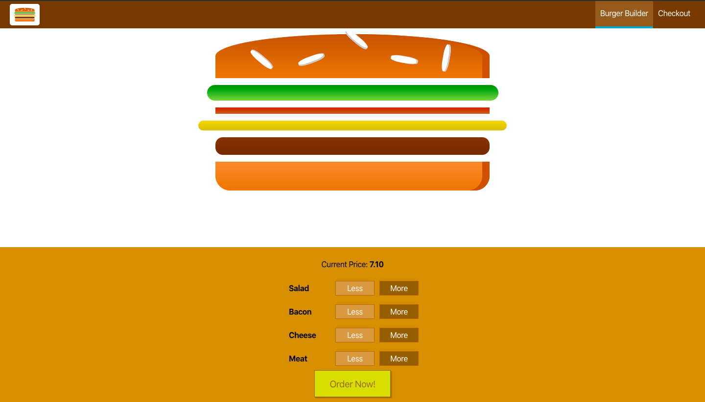

# Burger Builder
<div align="center">
    <a href="https://theburgerbuilderapp.netlify.com/">
        
    </a>
</div>

<br />

<div align="center">

[](https://theburgerbuilderapp.netlify.com/)
<br />
[](https://www.codacy.com/manual/martincserep/BurgerBuilder?utm_source=github.com&amp;utm_medium=referral&amp;utm_content=martincserep/BurgerBuilder&amp;utm_campaign=Badge_Grade)
 [](https://github.com/supunlakmal/thismypc/graphs/commit-activity) [](https://theburgerbuilderapp.netlify.com/) 
[](https://gitter.im/burgerbuilder/community)
</div>

> ThisMyPC provides a neat web interface that can be used for browsing your desktop drives from any device in your browser itself. With the help of NodeJs, the file details are displayed in JSON format that can then we easily displayed in web browsers.

> The source code is open so that you can download the source code and set it up with ease if you would like to have your own exclusive environment.

## Demo - https://theburgerbuilderapp.netlify.com/


## App Screenshots

  Login         |  Burger Builder | Checkout |  
:--------------:|:---------------:|:--------:|
Not implemented ||Not implemented |

## Folder Structure

    .
    ├── .github/ISSUE_TEMPLATE
    ├── doc                          # All Api doc and gif files (Work in progress)
    ├── public
    ├── src							 # React website folder                 
    ├── .gitignore
    ├── .gitlab-ci.yml
    └── README.md

## What (Burger Builder) ?

Work in progress...

## Why (Burger Builder) ?

- Work in progress...
- Work in progress...

## How to (Wiki) ?

All usage instruction and information update on [Github Wiki](https://github.com/martincserep/BurgerBuilder/wiki)

## Developing

### Platforms

Platform| Status
------------ | -------------
Web | Developing
iOS  | Pending
Android  | Pending

#### Built With

- [Node JS](https://nodejs.org/en/)
- [React](https://reactjs.org/)
- [Firebase](https://www.mongodb.com/)
- [React Native](https://facebook.github.io/react-native/)

#### Clone Project

```shell
git clone https://github.com/martincserep/BurgerBuilder.git
```


This Command  will copy a full  project  to your local  environment

## React Project

### Setting up React Project

```shell
    cd burgerbuilder
    npm i
```


`cd burgerbuilder` Move into react Project Folder
`npm i` install all  dependency.

### Run React Project

Run `npm start` for a dev server. Navigate to `http://localhost:3000/`. The app will automatically reload if you change any of the source files.

## React Native Project

Work in progress...
